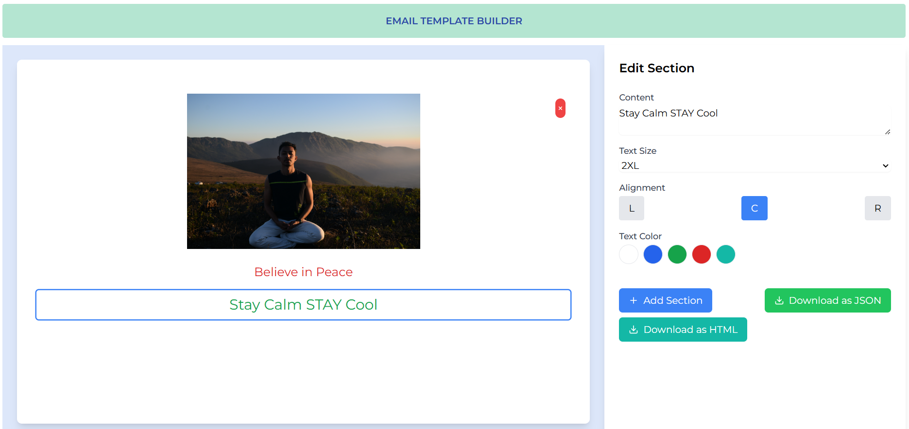

# Email Template Builder

A modern, responsive email template builder built with React, Vite, and Tailwind CSS. Create, customize, and export beautiful email templates with an intuitive drag-and-drop interface.



## 🌟 Features

- **Visual Email Editor**

  - Drag and drop sections
  - Real-time preview
  - Customizable text and styling

- **Rich Customization Options**

  - Text size adjustment
  - Color selection
  - Alignment controls
  - Font styling

- **Section Management**

  - Add new sections
  - Reorder sections
  - Delete sections
  - Edit section content

- **Export Functionality**
  - Download templates as JSON
  - Reusable template format

## 🚀 Technologies Used

- React 18
- Vite
- Tailwind CSS
- Lucide React (for icons)

## 📋 Prerequisites

Before you begin, ensure you have the following installed:

- Node.js (v14.0.0 or higher)
- npm (v6.0.0 or higher)

## 💻 Installation

1. Clone the repository:

```bash
git clone https://github.com/yourusername/email-template-builder.git
```

2. Navigate to the project directory:

```bash
cd email-template-builder
```

3. Install dependencies:

```bash
npm install
```

4. Start the development server:

```bash
npm run dev
```

5. Open your browser and visit `http://localhost:5173`

## 🛠️ Project Structure

```
email-template-builder/
├── src/
│   ├── components/
│   ├── utils/
│   ├── App.jsx
│   └── main.jsx
├── public/
├── index.html
└── package.json
```

## 📝 Usage

1. **Creating a New Template**

   - Click "Add Section" to add new content blocks
   - Click on any section to edit its content and styling
   - Use the styling controls in the right panel to customize appearance

2. **Editing Sections**

   - Select any section to modify its content
   - Use the toolbar to adjust text size, color, and alignment
   - Drag sections up or down to reorder

3. **Exporting Templates**
   - Click the "Download" button to export your template
   - Templates are saved in JSON format for easy reuse

## 🔧 Configuration

### Tailwind Configuration

The project uses a custom Tailwind configuration. To modify it, edit `tailwind.config.js`:

```javascript
module.exports = {
  content: ["./index.html", "./src/**/*.{js,ts,jsx,tsx}"],
  theme: {
    extend: {
      // Add your custom configurations here
    },
  },
  plugins: [],
};
```

## 🤝 Contributing

1. Fork the repository
2. Create a new branch (`git checkout -b feature/amazing-feature`)
3. Commit your changes (`git commit -m 'Add some amazing feature'`)
4. Push to the branch (`git push origin feature/amazing-feature`)
5. Open a Pull Request

## 📜 License

This project is licensed under the MIT License.

## 👏 Acknowledgments

- [React Documentation](https://reactjs.org/)
- [Tailwind CSS](https://tailwindcss.com/)
- [Vite](https://vitejs.dev/)
- [Lucide Icons](https://lucide.dev/)

## 🎯 Roadmap

- [ ] Add template sharing functionality
- [ ] Implement undo/redo features
- [ ] Add more section types (images, buttons, dividers)
- [ ] Add responsive preview mode
- [ ] Implement template saving to cloud storage
- [ ] Add collaboration features

## ✨ Support

For support, open an issue in the GitHub repository.

---

Made with ❤️ by Kisholoy Roy
